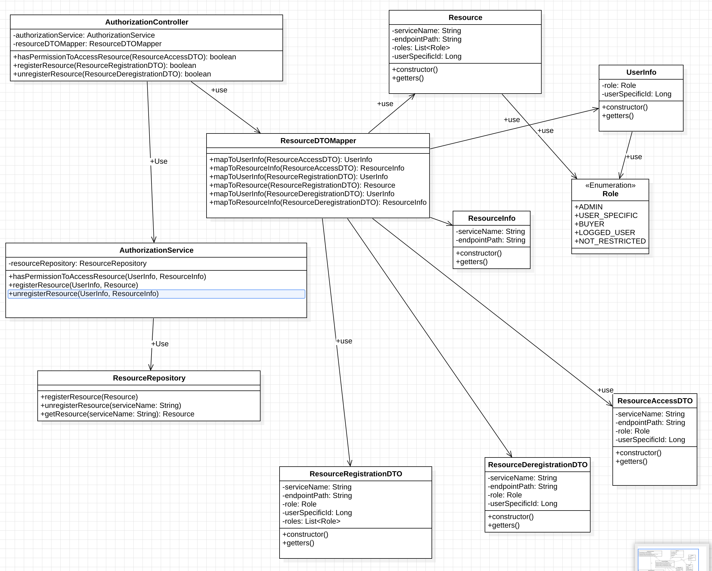

# authorisation-service

## Responsibilities:
* Providing, or denying permissions to access for users. If permission is granted, service return endpoint to the requested resource

## Functionality:
* hasPermissionToAccessResource(ResourceAccessDTO): HttpResponse
* registerResource(ResourceRegistrationDTO): HttpResponse
* unregisterResource(ResourceDeregistrationDTO): HttpResponse

## Enumeration - Role:
* ADMIN_ONLY
* BUYER (for writing reviews)
* LOGGED_USER (for browsing the history of orders)
* NOT_RESTRICTED (browsing products, reviews)

## Entities:
### Resource (and its data:)
endpointPath `String` 
serviceName `String` 
roles `List<Role>` 
userSpecificId `Long` 

## Table Schema
### resource table: (PRIMARY KEY: endpointPath )
    endpointPath TEXT PRIMARY KEY,
    serviceName TEXT NOT NULL,
    roles TEXT NOT NULL,
    userSpecificId BIGINT

### Class diagram:

## Using Compose manifest
### To run db for the app:
1) being in the root folder of the project, type in the terminal: 'cd docker'
2) type 'docker-compose --env-file=.env up -d' to run container with postgres in detached mode
3) connect to db using DBeaver, providing the following info:
* port: 5432
* user: dev
* password: MyPass
* database: auth

### another docker commands
- `docker-compose stop`: Stops running containers without removing them. They can be started again with `docker-compose start`.

- `docker-compose down`: Stops the containers and removes them along with their associated networks.