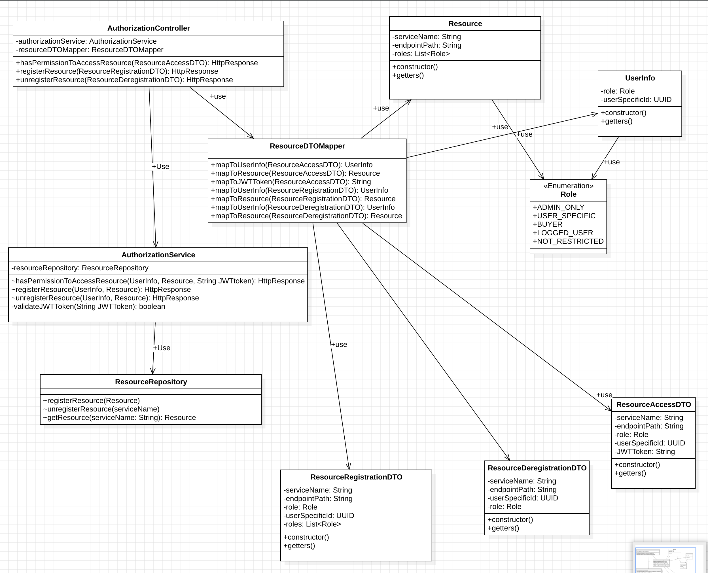

# authorisation-service

## Responsibilities:
* Providing, or denying permissions to access for users. If permission is granted, service return endpoint to the requested resource

## Functionality:
* hasPermissionToAccessResource(ResourceAccessDTO): HttpResponse
* registerResource(ResourceRegistrationDTO): HttpResponse
* unregisterResource(ResourceDeregistrationDTO): HttpResponse

## Enumeration - Role:
* ADMIN_ONLY
* BUYER (for writing reviews)
* LOGGED_USER (for browsing the history of orders)
* NOT_RESTRICTED (browsing products, reviews)

## Entities:
### Resource (and its data:)
`String` serviceName 
`String` endpointPath 
`List<Role>` roles 

## Table Schema
### resource table: (PRIMARY KEY: service_name )
service_name: `String` 
endpoint_path: `String` 
roles:  `List<Role>` 

### Class diagram:

